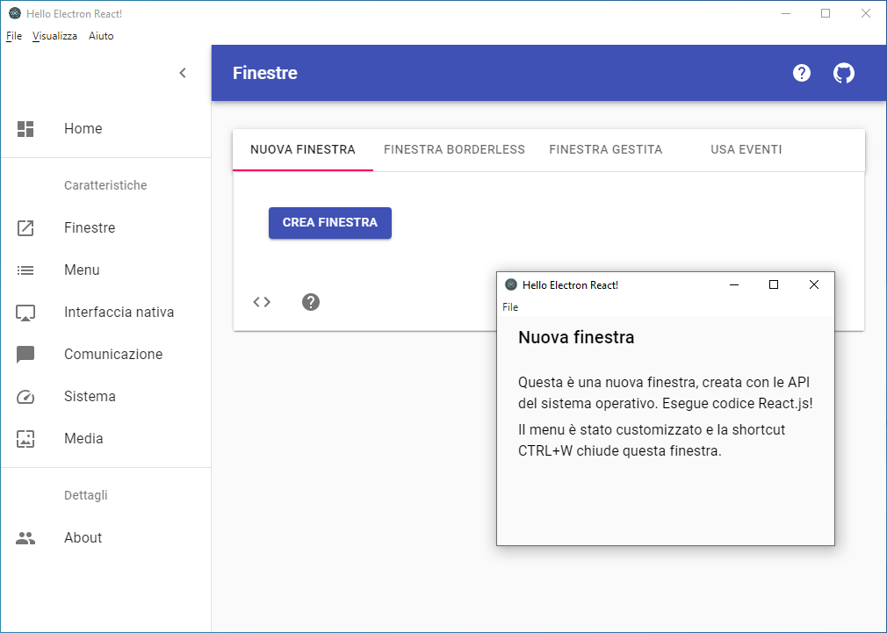
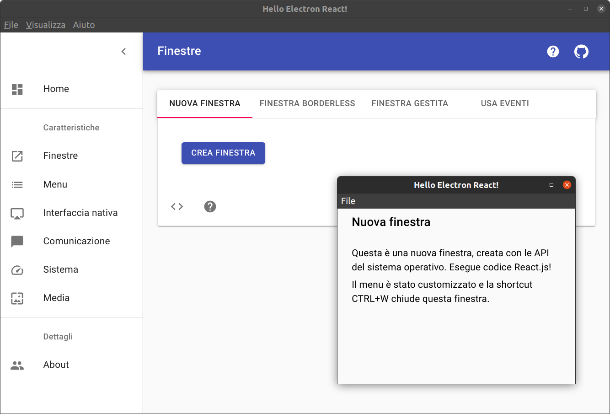

# Electron Demo React

> Luca Parolari, 1236601, luca.parolari@studenti.unipd.it \
> Corso di Mobile Programming & Multimedia \
> Dipartimento di Matematica \
> Università degli Studi di Padova

Tutto il codice della demo è disponibile su GitHub, con le relative
istruzioni di compilazione.

> [https://github.com/lparolari/electron-react-api-demos](https://github.com/lparolari/electron-react-api-demos)

Questo documento può essere anche letto sulla sua versione online con
immagini animate delle demo al link riportato di seguito.

> [https://github.com/lparolari/electron-react-api-demos/blob/master/docs/README.md](https://github.com/lparolari/electron-react-api-demos/blob/master/docs/README.md)

## Introduzione

L'applicazione desktop _electron-demo-react_ (d'ora in poi riferita
come _app_ o _demo_) mostra in modo interattivo alcune delle
funzionalità principali del framework
[Electron.js](https://www.electronjs.org/), approfondendo quindi
tramite esempi l'utilizzo delle API e degli widget di Electron.js.

La demo sviluppata consiste in un'applicazione desktop basata
principalmente sul framework cross-platform Electron.js, associato
alla libreria [React.js](https://reactjs.org/) per la gestione
dell'interfaccia utente e al linguaggio di programmazione
[TypeScript](https://www.typescriptlang.org/), un superset di
JavaScript, che assicura la _type safety_.

Il seguente documento ha lo scopo di illustrare le funzionalità
implementate nella demo senza specificare i dettagli tecnici e/o,
facilmente reperibili sulla documentazione e nel codice di questo
progetto, ma facendo in modo di essere una sorta di guida "by
examples" per alcune funzionalità di Electron.js. Allo stesso tempo
però la demo sviluppata è utilizzata come un pretesto per studiare ed
identificare le potenzialità principali di Electron.js, compresi
relativi svantaggi e punti deboli.

La sezione [Conclusioni](#conclusioni) tira le somme sul progetto ed
in particolare sul framework Electron.js, oggetto dello studio. Alla
sezione [Demo](#demo) vengono discussi i dettagli della demo
sviluppata, mentre alla sezione [Electron.js](#electronjs) viene
approfondito il framework e le sue caratteristiche.

## Indice

- [Introduzione](#introduzione)
- [Conclusione](#conclusione)
- [Demo](#demo)
  - [Struttura](#struttura)
  - [Codice](#codice)
  - [Funzionalità](#funzionalità)
    - [Framed Window](#framed-window)
    - [Frameless Window](#frameless-window)
    - [Managed Window](#managed-window)
    - [Events Window](#events-window)
    - [Menu Applicazione](#menu-applicazione)
    - [Menu Contestuale](#menu-contestuale)
    - [Gestore file](#gestore-file)
    - [Risorsa esterna](#risorsa-esterna)
    - [Notifiche](#notifiche)
    - [Tray](#tray)
    - [Messaggi asincroni](#messaggi-asincroni)
    - [Info app e sistema](#info-app-e-sistema)
    - [Copia e incolla](#copia-e-incolla)
    - [Screenshot](#screenshot)
- [Electron.js](#electronjs)
  - [Electron Core](#electron-core)
  - [Electron APIs](#electron-apis)
  - [UI tools](#ui-tools)
  - [Funzionalità native](#funzionalità-native)
  - [Pro e contro](#pro-e-contro)
  - [Alternative](#alternative)
  - [Valutazione](#valutazione)
- [Riferimenti](#riferimenti)

## Conclusione

In conclusione, ho trovato Electron.js un ottimo framework
cross-platform per lo sviluppo di applicazioni desktop grazie
principalmente a tre fattori che personalmente me l'hanno fatto
apprezzare molto: (1) documentazione ricca con numerosi esempi, (2)
bootstrap dell'applicazione immediato e (3) facilità di utilizzo con
background da web developer.

Ritengo che Electron.js sia un framework piuttosto maturo e supportato
e che sia l'ideale per sviluppare applicazioni desktop non troppo
complesse. Ho trovato il suo sistema di build sorprendentemente
robusto e semplice da utilizzare anche tra sistemi differenti.

Electron.js non è comunque esente da alcuni svantaggi che al di là
delle performance, developer experience e feature ne limitano
l'utilizzo in certi contesti. Uno dei problemi più impattanti a
livello interfaccia grafica è il non supporto out-of-the-box ad un
look & feel nativo, solitamente preferibile in app dekstop. Per quanto
riguarda invece i problemi tecnici, lo svantaggio principale è che non
esiste un sistema integrato che si occupa di differenziare le chiamate
native a seconda del sistema su cui si eseguie l'applicazione. Di
fatto, in alcuni casi, il programmatore è chiamato a scrivere del
codice specifico per ogni piattaforma. Questo complica notevolmente la
struttura dell'applicazione e allunga i tempi di sviluppo oltre a
rendere difficile l'implementazione uniforme di alcune funzionalità ed
il testing.

## Demo

La demo implementa alcune funzionalità interessanti di Electron.js e
mostra tramite esempi e snippet di codice come è possibile utilizzare
il framework per costruire un'applicazione vera e propria.

Ecco due schermate che mostrano come l'applicazione si presenta su
Windows e su Linux.





### Struttura

L'applicazione è stata creata a partire da una boilerplate predisposta
dal team di Electron.js in collaborazione con la community:
[electron-react-boileplate](https://github.com/chentsulin/electron-react-boilerplate).
Quest'ultima può essere installata ed utilizzata come pacchetto di
partenza per applicazioni Electron.js + React.js. Essa fornisce una
serie di funzionalità molto utili ai developer, oltre ad essere
predisposta per poter iniziare con lo sviluppo senza ulteriori
configurazioni.

Internamente la boilerplate integra il tool
[electron-builder](https://github.com/electron-userland/electron-builder),
definito come "una soluzione completa per costruire e pacchettizzare
applicazioni Electron.js pronte per la distrubuzione". Questo
strumento infatti punta a ridurre la complessità della distribuzione
delle applicazioni gestendo e integrando funzionalità per la
pacchettizzazione su diverse piattaforme, distribuzione,
aggiornamenti, ecc.

### Codice

L'organizzazione interna del codice segue principalmente le linee
guida di React.js, Node.js ed Electron.js.

In questo caso l'applicazione è organizzata in una serie di cartelle e
sottocartelle, alcune delle quali contengono codice sorgente, altre
file di configurazione e altre ancora delle risorse richieste da
Electron.js per poter integrare le sue funzionalità.

```
.
|-- app
|-- configs
|-- dll
|-- docs
|-- internals
|-- node_modules
|-- release
|-- resources
`-- test
```

In ordine troviamo

- `app`, con il codice sorgente dell'applicazione (principalmente
  React.js);

- `configs`, con le configurazioni [webpack](https://webpack.js.org/)
  ovvero lo strumento per costruire dei bundle ottimizzati per
  applicazioni JavaScript ed altre eventuali configurazioni;

- `dll` ed `internals`, con alcuni file predisposti dalla boilerplate
  per migliorare il funzionamento di Electron.js in fase di sviluppo;

- `docs`, con la documentazione del progetto;

- `node_modules`, con tutti i pacchetti installati per questo
  progetto;

- `release`, con i file compilati da Electron.js durante la fase di
  costruzione e pacchettizzazione dell'app per le varie piattaforme;

- `resources`, con i file statici dell'applicazione;

- `test`, con i test di unità dell'applicazione.

> Attenzione! La navigazioe della cartella `app` richiede la
> conoscenza di React.js.

### Funzionalità

> Nota: sfortunatamente il pdf generato non può contenere immagini
> animate. Le demo sono allegate al documento e per ogni demo è
> fornito un link all'immagine animata online.

#### Framed Window

Crea una finestra con il frame del sistema operativo. Conferisce un
look & feel nativo alla finestra e consente di creare finestre modali.

Si veda la figura
[Finestra con bordi](https://github.com/lparolari/electron-react-api-demos/blob/master/docs/demo/framed-window.gif).

#### Frameless Window

Crea una finestra senza bordi. Può essere utilizzata principalmente
per (1) personalizzare il look & feel dell'applicazione oppure (2)
bloccare l'interazione dell'utente sulla finestra (modale) che
richiede interazione obbligatoria.

Si veda la figura
[Finestra senza bordi](https://github.com/lparolari/electron-react-api-demos/blob/master/docs/demo/frameless-window.gif).

#### Managed Window

Crea una finestre e il chiamante ha accesso alle sue proprietà: può
leggerle o modificarle. Si veda la figura
[Finestra gestita](https://github.com/lparolari/electron-react-api-demos/blob/master/docs/demo/managed-window.gif).

#### Events Window

Crea una finestra e si mette in ascolto di alcuni eventi che la
finestra può offrire, nell'esempio la perdita del focus. Si veda la
figura
[Finestra con eventi](https://github.com/lparolari/electron-react-api-demos/blob/master/docs/demo/events-window.gif).

#### Menu Applicazione

Crea o modifica il menu dell'applicazione per inserire funzionalità
contestuali alle operazioni che l'utente sta svolgendo.

Si veda la figura
[Menu applicazione](https://github.com/lparolari/electron-react-api-demos/blob/master/docs/demo/app-menu.gif).

#### Menu Contestuale

Crea un menu contestuale attivabile tramite una azione dell'utente
come la pressione di un pulsante oppure il click del tasto destro. Per
la seconda operazione bisogna registrare un callback sull'evento
_click tasto destro_.

Si veda la figura
[Menu contestuale](https://github.com/lparolari/electron-react-api-demos/blob/master/docs/demo/context-menu.gif).

#### Gestore file

Apre il gestore dei file del sistema operativo su una cartella
specificata, nell'esempio la home dell'utente (cross-platform).

Si veda la figura
[Gestore file](https://github.com/lparolari/electron-react-api-demos/blob/master/docs/demo/open-home-files.gif).

#### Risorsa esterna

Apre la una risorsa estarna identificata da un URI tramite
l'applicazione di default che gestisce il protocollo della risorsa.
Nell'esempio viene aperto un link a Google.

Si veda la figura
[Risorsa esterna](https://github.com/lparolari/electron-react-api-demos/blob/master/docs/demo/open-browser.gif).

Invia una notifica mostrata tramite il sistema operativo come una
notifica nativa. Le notifiche in Electron.js sono personalizzabili ma
il supporto cross-platform è limitato e la notifica visualizzata
dipende molto dal sistema operativo.

Si veda la figura
[Notifiche](https://github.com/lparolari/electron-react-api-demos/blob/master/docs/demo/notifications.gif).

#### Tray

Crea un'icona nel tray del sistema operavo. L'icona del tray può
essere arricchita con diverse funzionalità con cui l'utente può
interagire anche avendo l'app in background.

Si veda la figura
[Tray](https://github.com/lparolari/electron-react-api-demos/blob/master/docs/demo/tray.gif).

#### Messaggi asincroni

Utilizza la comunicazione IPC asincrona tra il processo _renderer_ che
invia il messaggio e il processo _main_ che invece gestisce e risponde
al messaggio.

In electron la comunicazione IPC è semplificata da delle API molto
intuitive che permettono di aggiungere _callback_ su canali ed inviare
messaggi su canali.

Nell'esempio il renderer invia il messaggio `ping` e il main risponde
con `pong`. Si veda la figura
[Messaggi asincroni](https://github.com/lparolari/electron-react-api-demos/blob/master/docs/demo/async-messages.gif).

#### Informazioni app e sistema

Accede a informazioni dell'applicazione e del sistema operativo.

Nell'esempio vengono recuperate le informazioni sul path di
installazione dell'applicazione, la versione di Electron.js in uso, il
percorso della cartella utente e le dimensioni dello schemro
utilizzato per l'app.

Si veda la figura
[Informazioni app e sistema](https://github.com/lparolari/electron-react-api-demos/blob/master/docs/demo/info.png).

#### Copia e incolla

Utilizza la clipboard del sistema operativo per copiare e incollare
testo.

Si veda la figura
[Copia e incolla](https://github.com/lparolari/electron-react-api-demos/blob/master/docs/demo/copy-paste.gif).

#### Screenshot

Cattura un'istantanea dell'applicazione. Nell'esempio la schermata
catturata è salvata in una directory temporanea e immediatamente
visualizzata con il viewer di default per le immagini.

Si veda la figura
[Screenshot](https://github.com/lparolari/electron-react-api-demos/blob/master/docs/demo/screenshot.gif).

## Electron.js

**Cos'è Electron?** Electron.js è un framework cross-platfrom per
creare applicazione con tecnologie web come JavaScript, HTML e CSS. Le
applicazione create con Electron.js possono essere facilmente
"pacchettizzate" in diversi formati distribuibili ed eseguibili sui
principali sistemi operativi in uso attualmente: macOS, Windows e
Linux. Ciò è reso possibile grazie a strumenti come Node.js per
l'interazione con il file system e con il sistema operativo e Chromium
per renderizzare il contenuto a video.

**Scope e target.** Electron.js è stato sviluppato come progetto
proprietario da [GitHub](https://github.com/) nel 2013 principalmente
per sviluppare l'editor [Atom](https://atom.io/), ed è poi diventato
un progetto open-source nel 2014.

L'utenza target di Electron.js sono principalmente gli web developer
con conoscenze HTML, CSS e JavaScript che vogliono rendere le loro
applicazioni installabili come app desktop.

**Diffusione.** Electron.js è un framework che non ha avuto una grossa
esplosione iniziale, ma sicuramente si colloca tra i tool più
utilizzati per sviluppare applicazioni desktop basate su tecnologie
web.

Electron.js inoltre può contare su di un
[parco applicazioni](https://www.electronjs.org/apps) open-source
molto ricco che fanno da esempio, oltre ad alcune app sviluppate con
Electron.js di notevole rilevanza come
[WhatsApp](https://www.whatsapp.com/),
[VS Code](https://code.visualstudio.com/),
[Twich](https://twitch.com/), [Slack](https://slack.com/) e
[Figma](https://figma.com/).

La [community](https://www.electronjs.org/community) è molto attiva
anche grazie al fatto che viene prestata molta attenzione e cura alle
[traduzioni](https://www.electronjs.org/languages) della
documentazione, allo sviluppo di applicazioni di esempio come
[Electron API demos](https://github.com/electron/electron-api-demos) e
[Electron Fiddle](https://github.com/electron/fiddle) e alla
manutenzione di una miriade di
[tools](https://www.electronjs.org/community#tools) che semplificano
l'esperienza di programmazione in Electron.js.

Da un punto di vista quantitativo la diffusione di Electron.js può
essere analizzata visualizzandone il trend su
[stackoverflow trends](https://insights.stackoverflow.com/trends?tags=electron)
e [npm trends](https://www.npmtrends.com/electron). Un altro
riferimento può essere dato dal numero dell GitHub stars che
attualmente ammontano a
[88k](https://github.com/electron/electron/stargazers).

### Electron Core

Per permettere lo sviluppo di applicazioni eseguibili su tre
piattaforme diverse con tecnologie web Electron.js usa un particolare
sistema che permette di istanziare un browser Chromium per
visualizzare il contenuto dell'applicazione in finestre. In più, esso
ottiene l'accesso alle API di Node.js e può quindi interagire con il
file system ed il sistema operativo, proprio come Node.js.

Ciò ha un sacco di implicazioni interessanti: prima tra tutte il fatto
che l'applicazione tecnicamente può funzionare anche senza una
connessione ad internet. Da non sottovalutare poi il fatto che per
l'ambiente Node.js sono stati sviluppati moltissimi package che
implementano le funzionalità più disparate, e di conseguenza possono
essere facilmente integrati in un'applicazione Electron.js.

Un'applicazione Electron.js quindi non è altro che un'applicazione
Node.js con un'interfaccia web.

Da ciò si evince che

> Electron.js è un framework interpretato secondo la classificazione
> di Raj-Tolety

seppur i bundle prodotti sono applicazioni direttamente installabili
ed eseguibili come app native. Questo accade perché il pacchetto
generato è semplicemente un wrapper per un'istanza del browser
Chromium e Node.js, i quali poi interpretano il codice JavaScript.

### Electron APIs

Proprio come Node.js al quale si appoggia, anche Electron.js è
fortemente basato su eventi, i quali sono notificati nell'oggetto app
di Electron.js.

Electron.js inoltre fornisce delle API per l'accesso alle funzionalità
che vengono diversificate in base al tipo di processo che le richiede.
In particolare Electron.js implementa due tipi di processi: main
process e renderer process.

**Main process.** Il main process, anche detto "browser process" è il
processo che gestisce:

- la creazione di funzionalità native come menu, trays, notifiche ed
  altri widget legati al sistema operativo;

- la creazione di altri processi di renderer;

- l'accesso completo alle API di Node.js.

Inoltre, è il primo processo ad essere istanziato all'avvio
dell'applicazione e ne rappresenta anche l'entry point.

**Renderer process.** Il renderer process è un processo il cui scopo è
quello di gestire le finestre del browser e renderizzarne il
contenuto. Ogni finestra è associata ad un renderer process, proprio
come in Chromium e questo processo può dialogare tramite comunicazione
IPC con gli altri renderer process o con il main process.

### UI tools

Electron.js è stato principalmente pensato per implementare interfacce
grafiche in HTML, CSS e JavaScript. Tuttavia, data la sua natura,
viene lasciata una grossa libertà di utilizzo per quanto riguarda la
costruzione della UI: possono infatti essere impiegate tutte le
tecnologie attualmente disponibili per lo sviluppo web come
[Vue.js](https://vuejs.org/), [React.js](https://reactjs.org/),
[Angular](https://angular.io/), ed altre con tanto di librerie
grafiche come [Bootstrap](https://getbootstrap.com/),
[Material UI](https://material-ui.com/),
[Semantic UI](https://semantic-ui.com/) e chi più ne ha più ne metta.

Ecco quindi che Electron.js può essere visto semplicemente come il
fornitore di un ambiente web dove eseguire una qualunque applicazione
che può essere eseguita dal browser, con l'enorme valore aggiunto di
poter utilizzare componenti nativi dell'OS oltre al sistema di
"pacchettizzazione" delle app in bundle pronti da installare.

Chiaramente, questo può essere un grosso vantaggio ma al tempo stesso
uno svantaggio: il look & feel dell'applicazione dipende completamente
come il web developer disegna ed implementa i suoi componenti, o da
quale libreria importa per la costruzione degli stessi. Sono stati
fatti degli sforzi in questo senso con
[protonkit](http://photonkit.com/), libreria UI che tentava di emulare
il look & feel nativo (cross-platform), ma purtroppo il progetto è
stato abbandonato nel 2017. Si è tentano nuovamente con
[proton-native](https://proton-native.js.org/), una sorta di erede di
protonkit con il supporto a React.js, ma anche questo progetto sembra
essere stato abbandonato ad inizio 2020.

### Funzionalità native

Le funzionalità native fornite sono svariate e combinano la potenza di
Chromium con la versatilità di Node.js. La seguente lista non
esaustiva elenca alcune delle principali features, la maggior parte
delle quali sono state implementate nella demo.

- [Notifiche](https://www.electronjs.org/docs/tutorial/notifications)

- [Documenti recenti](https://www.electronjs.org/docs/tutorial/recent-documents)

- [Progress bar](https://www.electronjs.org/docs/tutorial/progress-bar)

- [Personalizzazione dock MacOS](https://www.electronjs.org/docs/tutorial/macos-dock)

- [Personalizzazione taskbar Windows](https://www.electronjs.org/docs/tutorial/windows-taskbar)

- [Personalizzazione desktop actions Linux](https://www.electronjs.org/docs/tutorial/linux-desktop-actions)

- [Scorciatoie da tastiera](https://www.electronjs.org/docs/tutorial/keyboard-shortcuts)

- [Rilevazione stato della connessione](https://www.electronjs.org/docs/tutorial/online-offline-events)

- [Drag & drop](https://www.electronjs.org/docs/tutorial/native-file-drag-drop)

- [Web embeds in Electron](https://www.electronjs.org/docs/tutorial/web-embeds)

Altre informazioni sono disponibili alla pagina ufficiale della
[documentazione](https://www.electronjs.org/docs#learning-the-basics)
di Electron.js.

### Pro e contro

Tra le innumerevole caratteristiche di Electron.js ci sono anche
alcune controindicazioni sull'uso di electron. Di seguito sono
elencate i principali punti di forza/debolezza di Electron.js

**Pro.**

- Trasforma applicazioni web in applicazioni desktop

- Facile da utilizzare per web developer

- Integra Node.js e le relative [librerie npm](https://www.npmjs.com/)

- Compatibile con i più diffusi framework per applicazioni web

- Supporta diversi strumenti UI/UX

- Flessibile e personalizzabile

- Supporta i principali sistemi operativi e anche
  [alcune varianti](https://www.electronjs.org/docs/tutorial/support#supported-platforms)

- Implementa svariate API per l'accesso a componenti nativi del
  sistema operativo

- Fornisce una documentazione adeguata e ricca di esempi

- Comprende una community molto attiva

**Contro.**

- Performance limite dalla sua natura di applicazione web

- Dimensione dei bundle prodotti piuttosto elevata

- Funzionalità e pacchetti di terze parti datati

- Diversificazione delle API in base ai sistema operativi

- Codice sorgente non criptato inserito nel bundle dell'app

- Utilizzo delle periferiche I/O del sistema limitato

- Look and feel dell'applicazione dipende dalla costruzione
  dell'interfaccia grafica

### Alternative

Di seguito sono elencati alcuni delle principali alternative ad
Electron.js attualmente sul mercato, anche se principalmente nessuno
di questi (tranne NW.js) è un competitor diretto di Electron.js perché
il desgin e la struttura dei progetti sono completamente diversi.

- [NW.js](https://nwjs.io/). Conosciuto anche come Node Webkit
  consente è un kit di strumenti che consentono di sviluppare
  applicazioni desktop cross-platform con strumenti web come HTML,
  CSS, JavaScript e WebGL.

- [Haxe](http://haxe.org/). Haxe è un kit di strumenti di sviluppo
  open-source ad alto livello che consentono di sviluppare
  applicazioni scritte in Haxe che possono poi essere compilate in
  differenti linguaggi e piattaforme target.

- [Qt](https://www.qt.io/). Qt è un framework cross-platform per lo
  sviluppo di applicazioni desktop, embedded e mobile. Qt non è un
  linguaggio di programmazione, ma è scritto in C++ e anche il codice
  utente è scritto in C++.

### Valutazione

In conclusione, secondo il mio parere Electron.js è un ottimo
framework per lo sviluppo di app desktop, semplice da usare per web
developer e supportato da moltissimi esempi e una community attiva.
Chiaramente, presenta alcuni svantaggi da non sottovalutare, i quali
però sono soggetti al dominio del problema che si cerca di risolvere.
Per quanto riguarda lo sviluppo di app standard secondo me è un ottimo
strumento.

## Riferimenti

TODO:

1. https://medium.com/@voltx180/a-beginners-guide-to-electron-js-1679fd7b6e4f
2. https://codeburst.io/electron-basics-and-fundamentals-b85b23aa611d
3. https://www.hongkiat.com/blog/frameworks-tools-build-cross-platform-desktop-apps/
4. https://www.slideshare.net/bethmigunasekara/electron-js-114413534
5. [Electron Framework Presentation](https://slides.com/juliamaksimchik/electron-awesome#/29/0/1)
6. https://medium.com/@nalegaveshardul40/electron-pros-and-cons-8f58fd6313d5
7. [Electron.js- The Best Framework to Build Cross-Platform Desktop Apps](https://www.techomoro.com/electron-js-the-best-framework-to-build-cross-platform-desktop-applications/)
8. https://haxe.org/
9. [Technical Differences Between Electron and NW.js | Electron](https://www.electronjs.org/docs/development/electron-vs-nwjs)
10. [About Qt - Qt Wiki](https://wiki.qt.io/About_Qt)
